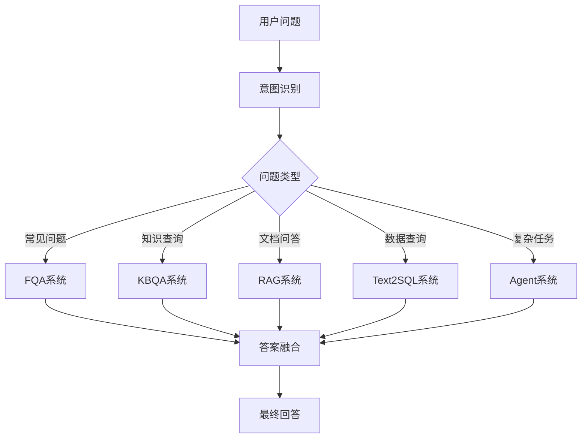

# 🧭 QA Systems Hub: 问答系统导航仓库

> **一站式QA技术栈导航** | 从传统检索到智能体，全面覆盖现代问答系统架构

本仓库是一个「导航型项目」，汇总并整理了多个主流问答系统的独立实现方式，包括传统QA技术与前沿大语言模型（LLM）/智能体（Agent）架构。适合对问答系统感兴趣的开发者、研究者、产品经理快速理解和跳转使用。

---

## 🎯 项目定位

📌 **QA Systems Hub** 本身不包含具体代码实现，而是作为技术导航中心：

- 🗂️ **统一收录**各类问答技术子项目
- 📊 **技术对比**：每种QA类型进行简要说明与对比分析  
- 🎯 **场景指导**：提供适用场景、优缺点、工程建议
- 🔧 **架构设计**：解释企业级场景下如何组合为 **Hybrid QA**
- 📚 **学习路径**：为不同角色提供定制化学习建议

---

## 📋 **核心QA系统**

> **基于检索、匹配、生成的传统问答架构**

| **QA 类型**             | **简介**                                                                                     | **技术特点**                                                   | **项目链接**                                                            | **完成状态** | **适用场景**                           |
|----------------------|--------------------------------------------------------------------------------------------|----------------------------------------------------------|---------------------------------------------------------------------|------------|-------------------------------------|
| **🔍 FQA**              | **高频问答**：基于历史问答对的语义匹配与检索，适用于常见问题的快速响应                                     | 检索匹配、语义相似度、快速响应          | [FQA-System](https://github.com/EasonWong0327/Hybrid-FQA-System)       | ✅ **已完成**   | 客服系统、FAQ问答             |
| **🕸️ KBQA**             | **知识图谱问答**：通过结构化三元组进行语义查询，适合处理知识库类问题                                     | 图谱推理、SPARQL查询、结构化知识                              | [🚧 KBQA-System]()                                            | ⏳ **开发中**   | 专业领域问答、知识库查询       |
| **🎨 Multimodal QA**    | **多模态问答**：支持图像和文本等混合输入，适合处理视觉和文本结合的复杂问题                                     | 视觉理解、跨模态融合        | [🚧 Multimodal-QA-System]()                                   | ⏳ **开发中**   | 图文问答、视觉搜索     |
| **🗃️ Text-to-SQL QA**   | **自然语言转SQL**：将自然语言问题转化为SQL查询，适用于数据库问答系统                                       | 语义解析、SQL生成                     | [🚧 Text2SQL-QA-System]()                                     | ⏳ **开发中**   | 数据分析、商业智能      |
| **🤖 LLM-based QA**     | **大语言模型问答**：增强型问答系统，结合RAG模型处理文档检索和大规模问答                               | 文档检索、生成式回答           | [Hybrid-RAG-System](https://github.com/EasonWong0327/Hybrid-RAG-System) | ✅ **已完成**   | 文档问答、知识管理               |

---

## 🤖 **Agent-based QA 系统架构**

> **基于智能体的自主问答系统，支持工具调用、长链路推理、任务分解等复杂能力**

###  **为什么单独分类Agent-based QA？**

####  **技术架构层面的差异**
- **传统QA系统**：主要基于检索、匹配、生成的**单次交互模式**
- **Agent-based QA**：具备**自主决策能力**，支持多轮交互、工具调用、任务分解等**复杂行为链**

####  **交互模式的本质区别** 
- **核心QA**：问题 → 答案（相对静态的映射关系）
- **Agent QA**：问题 → 规划 → 执行 → 反思 → 答案（动态的推理过程）

| **Agent 类型**         | **核心能力**                                                                                 | **技术特点**                                                   | **项目链接**                                                            | **完成状态** | **适用场景**          |
|----------------------|--------------------------------------------------------------------------------------------|----------------------------------------------------------|---------------------------------------------------------------------|------------|---------------------|
| **🎯 Planner-Executor** | **任务规划与执行**：自动分解复杂任务并协调执行，支持工作流管理                 | 任务分解、执行协调、工作流编排                 | [🚧 Planner-Executor-QA]()                                     | ⏳ **开发中**   | 复杂业务流程自动化           |
| **🔧 Tool-Using**      | **工具调用智能体**：动态调用外部工具和API，扩展问答能力边界                                      | API集成、工具选择、动态调用     | [🚧 Tool-Using-QA]()                                           | ⏳ **开发中**   | 数据查询、服务集成         |
| **🔄 ReAct**           | **推理-行动循环**：观察-思考-行动的循环模式，支持复杂推理链                                         | 反思机制、推理链、自我纠错            | [🚧 ReAct-QA]()                                                | ⏳ **开发中**   | 复杂推理、问题诊断             |
| **🔗 Long-Chain**      | **长链路推理**：处理需要多步骤深度思考的复杂问题                                            | 多步推理、上下文保持                             | [🚧 Long-Chain-QA]()                                           | ⏳ **开发中**   | 深度分析、研究辅助     |
| **🚀 Autonomous**      | **自主智能体**：具备完全自主的学习和执行能力                                          | 自主学习、策略优化                             | [🚧 Autonomous-QA]()                                           | ⏳ **开发中**   | 智能助手、自动化任务      |

---

## 🧠 企业级 Hybrid QA 策略

在实际业务中，单一QA系统难以满足所有需求。企业常采用 **Hybrid QA** 策略：

### 🔀 **路由策略设计**

### 🎯 **典型组合模式**
- **🏢 企业知识助手**：FQA + KBQA + LLM-based QA
- **📊 商业分析平台**：Text-to-SQL + LLM-based QA + Agent
- **🎨 创意设计工具**：Multimodal QA + Agent-based QA
- **🔬 科研辅助系统**：KBQA + Long-Chain Agent + Tool-Using Agent

> 📌 **本仓库策略**：不直接实现Hybrid QA，而是提供构建所需的「能力组件」集合。
> 👉 建议根据具体业务场景选择合适组件进行组合。

---

## 🗺️ 学习导航地图

### 📚 **按角色推荐的学习路径**

| 👤 **角色类型** | 🎯 **推荐顺序** | 💡 **重点关注** |
|--------------|---------------|----------------|
| **🎓 学生/初学者** | FQA → LLM-based QA → KBQA | 理解基础概念，掌握核心技术栈 |
| **🔬 研究人员** | KBQA → Multimodal QA → Agent系列 | 前沿技术探索，创新应用场景 |
| **⚙️ 工程师** | LLM-based QA → Agent-based QA → Hybrid设计 | 工程实践，系统架构设计 |
| **📋 产品经理** | 各模块简介 → 适用场景 → Hybrid策略 | 业务理解，产品规划 |

---

## 🚀 快速开始

### 1️⃣ **选择您的起点**
- 💡 **想快速体验？** → 直接访问 [FQA-System](https://github.com/EasonWong0327/Hybrid-FQA-System)
- 🔥 **追求前沿？** → 关注 Agent-based QA 系列开发进度
- 🏢 **企业应用？** → 研究 Hybrid QA 组合策略

### 2️⃣ **参与贡献**
- ⭐ Star 本项目保持关注
- 🐛 提交 Issue 报告问题或建议
- 🔀 Fork 项目进行个人定制
- 💬 参与 Discussions 技术交流

---

## 📊 项目状态

| 📈 **指标** | 📊 **当前状态** |
|------------|----------------|
| **已完成项目** | 2/7 (FQA, LLM-based QA) |
| **开发进度** | 🚧 KBQA, Multimodal, Text2SQL, Agent系列 |
| **下个里程碑** | Agent系列完成 (预计 08/2025) |

---

## 🤝 参与贡献

我们欢迎各种形式的贡献：

- 📝 **文档改进**：完善README、添加技术说明
- 💻 **代码贡献**：实现新的QA系统类型
- 🧪 **测试用例**：提供测试数据和基准测试
- 💡 **想法建议**：提出新的QA系统架构思路
- 🐛 **Bug报告**：发现并报告问题

---

## 📞 联系方式

**👨‍💻 作者**: EasonWong  
**📧 邮箱**: eason0912happy@gmail.com  
**🐙 GitHub**: [@EasonWong0327](https://github.com/EasonWong0327)

---

## 📜 开源协议

本项目采用 [MIT License](LICENSE) 开源协议。

---

## 🌐 多语言支持

- [🇨🇳 中文版 README](README.md) - 当前页面
- [🇺🇸 English README](README_EN.md) - English Version

---

## 🙏 致谢

感谢所有为QA系统技术发展做出贡献的研究者和开发者！

**如果这个项目对您有帮助，请考虑给个 ⭐ Star！**
