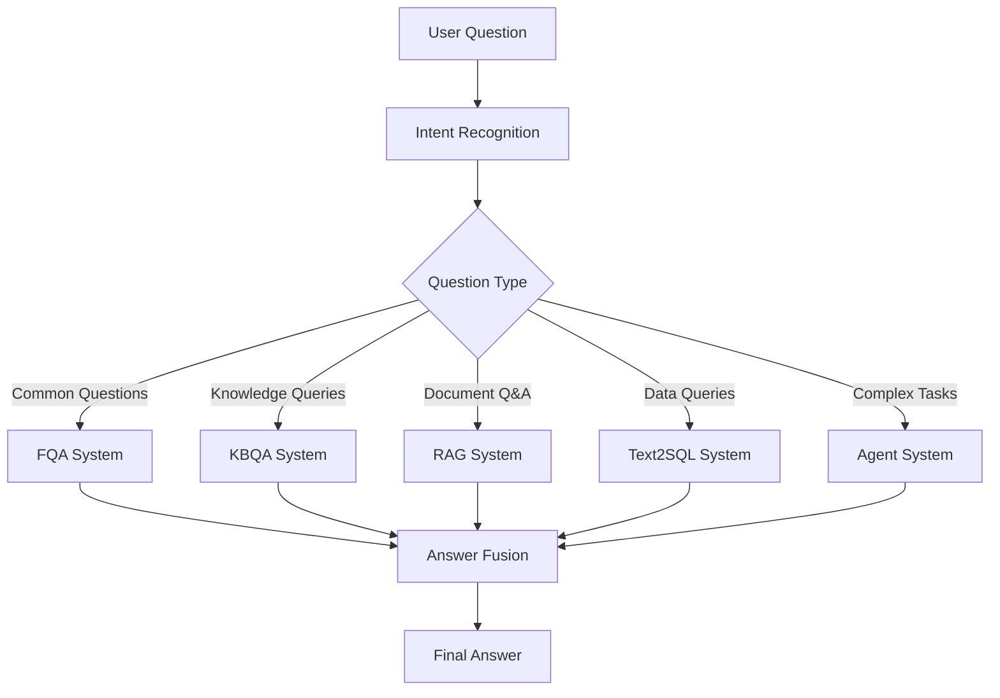

# 🧭 QA Systems Hub: Question-Answering Systems Navigation Repository

> **One-Stop QA Tech Stack Navigation** | From Traditional Retrieval to Intelligent Agents, Comprehensive Coverage of Modern QA System Architecture

This repository serves as a "navigation project" that consolidates and organizes multiple mainstream question-answering system implementations, including traditional QA technologies and cutting-edge Large Language Model (LLM)/Agent architectures. Perfect for developers, researchers, and product managers interested in QA systems to quickly understand and jump into usage.

---

## 🎯 Project Positioning

📌 **QA Systems Hub** itself does not contain specific code implementations, but serves as a technical navigation center:

- 🗂️ **Unified Collection** of various QA technology sub-projects
- 📊 **Technical Comparison**: Brief explanations and comparative analysis for each QA type  
- 🎯 **Scenario Guidance**: Providing applicable scenarios, pros/cons, and engineering recommendations
- 🔧 **Architecture Design**: Explaining how to combine into **Hybrid QA** in enterprise scenarios
- 📚 **Learning Paths**: Customized learning recommendations for different roles

---

## 📋 **Core QA Systems**

> **Traditional question-answering architectures based on retrieval, matching, and generation**

| **QA Type**             | **Description**                                                                                     | **Technical Features**                                                   | **Project Link**                                                            | **Status** | **Use Cases**                           |
|----------------------|--------------------------------------------------------------------------------------------|----------------------------------------------------------|---------------------------------------------------------------------|------------|-------------------------------------|
| **🔍 FQA**              | **Frequent Q&A**: Semantic matching and retrieval based on historical QA pairs, suitable for rapid response to common questions                                     | Retrieval matching, semantic similarity, quick response          | [FQA-System](https://github.com/EasonWong0327/Hybrid-FQA-System)       | ✅ **Completed**   | Customer service, FAQ systems             |
| **🕸️ KBQA**             | **Knowledge Base Q&A**: Semantic querying through structured triples, suitable for knowledge base questions                                     | Graph reasoning, SPARQL queries, structured knowledge                              | [🚧 KBQA-System]()                                            | ⏳ **In Development**   | Domain-specific Q&A, knowledge base queries       |
| **🎨 Multimodal QA**    | **Multimodal Q&A**: Supports mixed input of images and text, suitable for complex problems combining visual and textual elements                                     | Visual understanding, cross-modal fusion        | [🚧 Multimodal-QA-System]()                                   | ⏳ **In Development**   | Image-text Q&A, visual search     |
| **🗃️ Text-to-SQL QA**   | **Natural Language to SQL**: Converting natural language questions into SQL queries, suitable for database Q&A systems                                       | Semantic parsing, SQL generation                     | [🚧 Text2SQL-QA-System]()                                     | ⏳ **In Development**   | Data analysis, business intelligence      |
| **🤖 LLM-based QA**     | **Large Language Model Q&A**: Enhanced Q&A systems combining RAG models for document retrieval and large-scale question answering                               | Document retrieval, generative responses           | [Hybrid-RAG-System](https://github.com/EasonWong0327/Hybrid-RAG-System) | ✅ **Completed**   | Document Q&A, knowledge management               |

---

## 🤖 **Agent-based QA System Architecture**

> **Autonomous question-answering systems based on intelligent agents, supporting tool calling, long-chain reasoning, task decomposition, and other complex capabilities**

###  **Why Separate Agent-based QA?**

####  **Technical Architecture Differences**
- **Traditional QA Systems**: Primarily based on retrieval, matching, and generation with **single-interaction modes**
- **Agent-based QA**: Possesses **autonomous decision-making capabilities**, supporting multi-turn interactions, tool calling, task decomposition, and other **complex behavior chains**

####  **Essential Differences in Interaction Modes** 
- **Core QA**: Question → Answer (relatively static mapping relationship)
- **Agent QA**: Question → Planning → Execution → Reflection → Answer (dynamic reasoning process)

| **Agent Type**         | **Core Capabilities**                                                                                 | **Technical Features**                                                   | **Project Link**                                                            | **Status** | **Use Cases**          |
|----------------------|--------------------------------------------------------------------------------------------|----------------------------------------------------------|---------------------------------------------------------------------|------------|---------------------|
| **🎯 Planner-Executor** | **Task Planning & Execution**: Automatically decompose complex tasks and coordinate execution, supporting workflow management                 | Task decomposition, execution coordination, workflow orchestration                 | [🚧 Planner-Executor-QA]()                                     | ⏳ **In Development**   | Complex business process automation           |
| **🔧 Tool-Using**      | **Tool-Calling Agent**: Dynamically calls external tools and APIs, expanding Q&A capability boundaries                                      | API integration, tool selection, dynamic calling     | [🚧 Tool-Using-QA]()                                           | ⏳ **In Development**   | Data querying, service integration         |
| **🔄 ReAct**           | **Reasoning-Action Loop**: Observe-Think-Act循环模式, supporting complex reasoning chains                                         | Reflection mechanisms, reasoning chains, self-correction            | [🚧 ReAct-QA]()                                                | ⏳ **In Development**   | Complex reasoning, problem diagnosis             |
| **🔗 Long-Chain**      | **Long-Chain Reasoning**: Processing complex problems requiring multi-step deep thinking                                            | Multi-step reasoning, context preservation                             | [🚧 Long-Chain-QA]()                                           | ⏳ **In Development**   | Deep analysis, research assistance     |
| **🚀 Autonomous**      | **Autonomous Agent**: Possessing fully autonomous learning and execution capabilities                                          | Autonomous learning, strategy optimization                             | [🚧 Autonomous-QA]()                                           | ⏳ **In Development**   | Intelligent assistants, automated tasks      |

---

## 🧠 Enterprise-level Hybrid QA Strategy

In actual business scenarios, a single QA system cannot meet all needs. Enterprises often adopt **Hybrid QA** strategies:

### 🔀 **Routing Strategy Design**

### 🎯 **Typical Combination Patterns**
- **🏢 Enterprise Knowledge Assistant**: FQA + KBQA + LLM-based QA
- **📊 Business Analysis Platform**: Text-to-SQL + LLM-based QA + Agent
- **🎨 Creative Design Tools**: Multimodal QA + Agent-based QA
- **🔬 Research Support System**: KBQA + Long-Chain Agent + Tool-Using Agent

> 📌 **Repository Strategy**: Rather than directly implementing Hybrid QA, we provide a collection of "capability components" needed for construction.
> 👉 We recommend selecting appropriate components for combination based on specific business scenarios.

---

## 🗺️ Learning Navigation Map

### 📚 **Role-based Learning Paths**

| 👤 **Role Type** | 🎯 **Recommended Order** | 💡 **Key Focus** |
|--------------|---------------|----------------|
| **🎓 Students/Beginners** | FQA → LLM-based QA → KBQA | Understanding basic concepts, mastering core tech stack |
| **🔬 Researchers** | KBQA → Multimodal QA → Agent Series | Cutting-edge technology exploration, innovative application scenarios |
| **⚙️ Engineers** | LLM-based QA → Agent-based QA → Hybrid Design | Engineering practice, system architecture design |
| **📋 Product Managers** | Module Overview → Use Cases → Hybrid Strategy | Business understanding, product planning |

---

## 🚀 Quick Start

### 1️⃣ **Choose Your Starting Point**
- 💡 **Want to experience quickly?** → Directly visit [FQA-System](https://github.com/EasonWong0327/Hybrid-FQA-System)
- 🔥 **Pursuing cutting-edge?** → Follow Agent-based QA series development progress
- 🏢 **Enterprise applications?** → Study Hybrid QA combination strategies

### 2️⃣ **Contributing**
- ⭐ Star this project to stay updated
- 🐛 Submit Issues to report problems or suggestions
- 🔀 Fork the project for personal customization
- 💬 Participate in Discussions for technical exchange

---

## 📊 Project Status

| 📈 **Metric** | 📊 **Current Status** |
|------------|----------------|
| **Completed Projects** | 2/7 (FQA, LLM-based QA) |
| **Development Progress** | 🚧 KBQA, Multimodal, Text2SQL, Agent Series |
| **Next Milestone** | Agent Series Completion (Expected 08/2025) |

---

## 🤝 Contributing

We welcome contributions in all forms:

- 📝 **Documentation Improvement**: Enhancing README, adding technical explanations
- 💻 **Code Contributions**: Implementing new QA system types
- 🧪 **Test Cases**: Providing test data and benchmarks
- 💡 **Ideas & Suggestions**: Proposing new QA system architecture concepts
- 🐛 **Bug Reports**: Finding and reporting issues

---

## 📞 Contact

**👨‍💻 Author**: EasonWong  
**📧 Email**: eason0912happy@gmail.com  
**🐙 GitHub**: [@EasonWong0327](https://github.com/EasonWong0327)

---

## 📜 Open Source License

This project is licensed under the [MIT License](LICENSE).

---

## 🌐 Multi-language Support

- [🇨🇳 Chinese README](README.md) - 中文版本
- [🇺🇸 English README](README_EN.md) - Current Page

---

## 🙏 Acknowledgments

Thanks to all researchers and developers who have contributed to the advancement of QA system technologies!

**If this project helps you, please consider giving it a ⭐ Star!**
